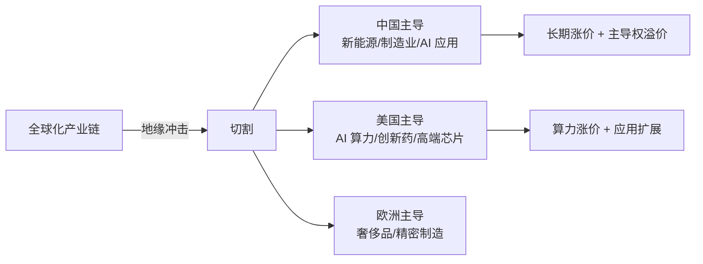

## 定义

> [!abstract] 一句话定义
> 产业视角投资法是 Z 哥在 2026-04 两场直播(04-19《产业资本与个人投资者的视角差异》+ 04-26《长期涨价论》)中系统化的投资视角论——**让个人投资者站到产业资本的角度去看主线选择**,把视野从"个股 K 线"放大到"国别产业切割 + 长期涨价循环"的格局。

## 关键信息

### 三层视角对比

| 视角 | 时间维度 | 关注点 | 决策依据 |
|---|---|---|---|
| **散户视角** | 几天-几周 | K 线 / 消息 | 短期涨跌 |
| **机构视角** | 几月-1 年 | 估值 / 业绩 | 财报与流动性 |
| **产业资本视角** | 3-10 年 | 国别产业切割 / 全球化 | 产业链份额 / 长期涨价 |

### 长期涨价论(2026-04-26 提炼)

> [!tip] 三个推论
> 1. **稀缺资源长期涨价**:有色 / 稀土 / 资源股的长牛底色
> 2. **本国产业链替代**:被打压方反而出清,留下的更稀缺(自主可控逻辑)
> 3. **国别产业切割**:全球化分工受地缘冲击,产业链按国别重新分配,中国主导的方向长期受益

### 国别产业切割逻辑

### 应用方法

1. **选择主线**:用产业视角问"这条产业链 3 年后还在中国手里吗?",在则可作中长 [[绝对主线]]
2. **持仓周期**:产业视角的主仓应配合 [[长线交易操作手册]],持仓 1 年级
3. **与短线协调**:[[少妇战法]] 的主线票优先选符合产业视角的方向
4. **判断退场**:产业逻辑被打破(如出口被禁/技术被替代)→主仓退出

### 与已有概念的协同

| 概念 | 协同点 |
|---|---|
| [[绝对主线]] | 产业视角提供主线的"宏观底色" |
| [[顺周期轮动]] | 产业视角是顺周期之上的更宏观维度 |
| [[新曼城阵容]] | 产业视角下的阵容选择更稳 |
| [[牛市策略]] | 产业视角是牛市里"做大"的根本 |
| [[价投真相与实操法则]] | 产业视角提供价投四种形态的产业判断 |

## 知识冲突

> [!caution] 与纯技术派的张力
> - 纯技术派:只看图,不看产业基本面
> - 产业视角:**主线选错则一切皆零**——技术只服务于"已选对主线"的前提
> - Z 哥本意:**技术 ≥ 产业 ≥ 宏观**,但每一层都不可替代
> - 采用方案:短线用技术,中长仓位用产业视角校验主线选择

## 关联连接
- [[绝对主线]] — 产业视角是主线选择的宏观依据
- [[牛市策略]] — 牛市做大的根本是站对产业
- [[长线交易操作手册]] — 产业视角的操作落地
- [[价投真相与实操法则]] — 产业视角的价投表达
- [[顺周期轮动]] — 产业视角的中观体现
- [[新曼城阵容]] — 产业视角下的阵容
- [[慢牛密码论]] — 慢牛的产业接续逻辑
- [[Zettaranc]] — 概念提炼者
