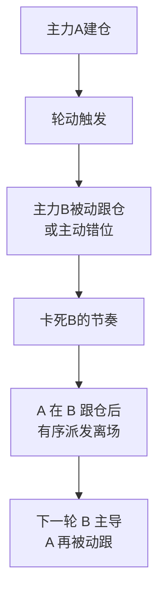

## 定义

> [!abstract] 一句话定义
> 卡节奏论是 Z 哥在 2026-01-28《煤飞色舞之后》直播中明确提炼的板块轮动机制论——**板块轮动的核心目的是卡所有对手盘的节奏(主力博弈),而非针对散户**;散户体量小,被波及只是副作用。

## 关键信息

### 核心论断

> [!tip] 三句心法
> 1. **板块轮动的对手不是散户,而是其他主力**(机构/游资/外资)
> 2. **散户其实不重要**——中国 2.5 亿账户中 90% 持仓 ≤5 万元
> 3. **真主力之间在卡节奏**——A 主力建仓 B 主力还没反应过来,C 主力踩着 A 的退潮拉自己的盘

### "散户不重要论"的依据

| 数据 | 含义 |
|---|---|
| 中国 A 股 2.5 亿账户 | 看似主体 |
| 7000 万有效账户 | 真在玩的不多 |
| 其中 ≥90% 持仓 ≤5 万 | 真散户能量微弱 |
| 主力**博士眼镜分仓** | 用上百个账户伪装散户席位 |

> [!info] "博士眼镜散户隐藏论"
> 主力把一笔几亿的仓位,拆散到 200+ 个看似散户的账户,在席位上看不见;真散户的存在只是噪声。所以"散户被收割"是表象,**真实博弈发生在伪装的主力账户之间**。

### 卡节奏的三种行为

### 对操作的启示

- **别站错队**:在主力 A 已派发末端跟进,等于给 B 主力当韭菜
- **看节奏不看个股**:[[活跃市值]] / [[新曼城阵容]] 是节奏判定工具
- **散户最优策略**:**让主力 A 帮你做完,在 B 跟仓时离场**(对应 [[半仓放飞策略]] 与 [[去弱留强]])

## 知识冲突

> [!caution] 与"散户被主力收割"叙事的张力
> - 主流叙事:主力割散户韭菜
> - 卡节奏论:主力之间在割,散户只是噪声
> - 采用方案:理解主力间博弈,把自己定位为"在主力 A 退潮前借势离场",而不是幻想被某个主力"照顾"

## 关联连接
- [[筹码战争]] — 卡节奏是筹码战争的微观机制
- [[A股博弈本质]] — 卡节奏论补充了"博弈对象"的定义
- [[AI控盘指数论]] — AI 时代的卡节奏更精准
- [[慢牛密码论]] — 慢牛的轮动节奏正是"卡对手盘"的宏观体现
- [[新曼城阵容]] — 阵容轮换是卡节奏的可观察结果
- [[活跃市值]] — 节奏判定工具
- [[五类资金画像]] — 各类主力卡彼此的节奏
- [[Zettaranc]] — 概念提炼者
