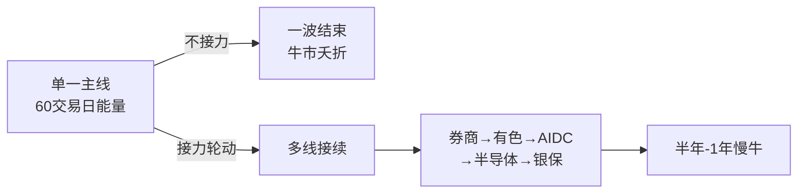

## 定义

> [!abstract] 一句话定义
> 慢牛密码论是 Z 哥在 2026-01-25 直播《2026慢牛密码破译》中提出的核心叙事——所谓"慢牛"不是自然慢,而是**机构通过板块轮动主动延长牛市**:把任何单一主线 60 个交易日(约 99 天)的能量分散到多条主线之间,使其首尾相接,把一波短行情拉成半年级牛市。

## 关键信息

### 核心论断

> [!tip] 99 天 / 60 交易日规律
> 单一板块(券商/有色/AIDC/半导体)主升浪能量约 60 个交易日(99 天)。如果让其一波结束,行情迅速拐头;如果**让另一条主线在第一条退潮前接力**,牛市可被人为拉长到 12 个月。

### 慢牛的三个机制

### 财政绑股权理论(底层逻辑)

> [!info] 历史类比
> - **过去 40 年**:财政绑**地产**(城镇化卖地财政)→财富蓄水池=房子
> - **本轮**:财政绑**股权**→财富蓄水池=**银行/保险/券商(银保券)**
>
> 因此银保券是慢牛末期"迟早要拉"的被动配置必然。

### 2026 慢牛的轮动地图(Z 哥推演)

| 阶段 | 主线 | 状态 |
|---|---|---|
| 第 1 棒 | 券商 | 已发动,99 天能量 |
| 第 2 棒 | 有色 / 煤炭 | 接力中(煤飞色舞) |
| 第 3 棒 | AIDC / 算力 | 待发动 |
| 第 4 棒 | 半导体 / 创新药泛圈 | 待发动 |
| **末棒** | **银行 / 保险 / 券商被动配置** | 慢牛终结时 |

### 操作含义
- **不要满仓押单线**:99 天后必换防,需要在轮动节点切换
- **关注接力信号**:看 [[活跃市值]] 与 [[新曼城阵容]] 的当期主力
- **理解"白银协议平仓"等催化**:外部催化也服务于轮动节奏

## 知识冲突

> [!caution] 与"主线一波到底"叙事的张力
> - 部分散户/媒体观点:牛市就是一条主线干到底
> - 慢牛密码论:**单线 60 日必换防**,不接受"一条龙到底"
> - 采用方案:遵循慢牛密码论的轮动节奏,把 [[绝对主线]] 视为"当期主线"而非"全程主线"

## 关联连接
- [[牛市策略]] — 本概念是其 2026 版具体推演
- [[牛市ETF躺平策略]] — 与慢牛密码相互呼应
- [[绝对主线]] — 当期主线的轮动机制
- [[顺周期轮动]] — 板块轮动的传统理解,本概念在此之上加了"99 天"时间维度
- [[新曼城阵容]] — 轮动地图的人格化表达
- [[活跃市值]] — 跨主线轮动节点的判定工具
- [[卡节奏论]] — 轮动是为了卡对手盘的节奏
- [[AI控盘指数论]] — 主力主动控盘下的慢牛
- [[Zettaranc]] — 概念提炼者
