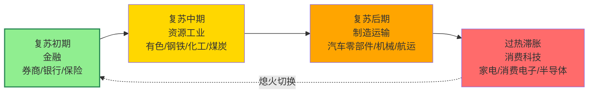

## 定义

> [!abstract] 一句话定义
> 顺周期轮动是经济上行期**板块按产业链传导顺序依次轮动上涨**的规律——金融→资源/工业→制造/运输→消费/科技。**让大哥(大资金)先动筷子,自己做第二波**,千万不要先于大哥进场埋伏。

## 关键信息
- **经典轮动顺序**：
  1. 复苏初期：金融板块（券商、银行、保险）
  2. 复苏中期：资源与工业材料（有色、钢铁、化工、煤炭）
  3. 复苏后期：制造业与运输（汽车零部件、机械、航运）
  4. 过热至滞胀：下游消费与部分科技（家电、消费电子、半导体）
- **实操策略**：大哥先动第一波上60日均线 → 少妇战法做第二波 → 熄火切换等下一个板块
- **六大主线**：大科技、固态电池、可控核聚变、AIDC、创新药、中国新消费
- **核心原则**：千万不要先于大哥进场埋伏，按顺序轮动找还没轮到的
- **反内卷逻辑**：供给侧出清→价格企稳→盈利修复→估值回归

## 四阶段轮动顺序

> [!tip] 大哥与少妇
> 大哥先动 = 板块第一波突破 60 日均线 → 少妇战法做第二波 → 熄火切换下一阶段。

## 关联连接
- [[绝对主线]] — 轮动中最确定的方向
- [[少妇战法]] — 轮动中的第二波操作工具
- [[择时大于选股]] — 先判断周期再决定
- [[活跃市值]] — 判断是否有增量资金入场
