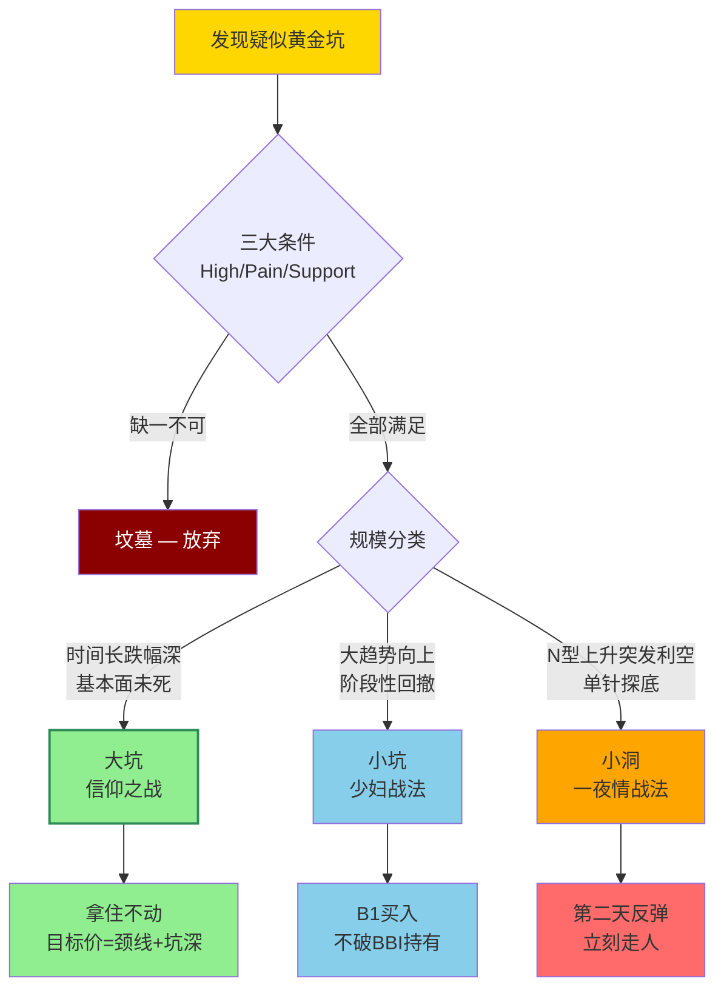

## 定义

> [!abstract] 一句话定义
> 黄金坑不是单纯下跌,而是**筹码彻底换手的过程**。真正的黄金坑必须满足**三大条件**:有前史(High) + 有惨烈(Pain) + 有企稳(Support)。按规模分为**大坑(信仰之战) / 小坑(少妇战法) / 小洞(一夜情战法)** 三类。

黄金坑不是单纯的下跌，而是筹码彻底换手的过程。**真正的黄金坑必须满足三个条件**：
1. **有前史（High）**：曾经辉煌过，有明确的历史高点
2. **有惨烈（Pain）**：经历长时间大幅下跌，到让人"屁滚尿流"绝望离场的程度
3. **有企稳（Support）**：不再创新低，开始横盘或温和走势

> [!caution] 哪些"坑"是万丈深渊
> 不是所有低位都叫"坑"，有的叫"坟墓"。三类绝对不能碰：
> 1. 没有填完"中型坑"的（一路下跌连像样反弹都没有）
> 2. 看不懂基本面的盲盒（不知道靠什么翻身）
> 3. 不属于当前主线题材的"孤魂野鬼"

## 第一类：大坑 —— 信仰之战，赚大钱

| 维度 | 描述 |
|------|------|
| **形态特征** | 时间跨度极长（如当年的白酒、李宁），跌幅巨大（腰斩再腰斩），基本面逻辑未死 |
| **策略** | **拿住不动** |
| **核心逻辑** | 确认主力开始填坑（突破关键颈线位）后，把自己当成"傻瓜"，中间震荡洗盘假破位统统不看 |
| **目标价计算** | **第一目标价 = (坑沿价格 - 坑底最低价) + 坑沿价格** |

> [!tip] 目标价计算公式（"祖宗之法"）
> 坑沿 = 颈线位/起跌点/长期盘整箱体顶部
> 坑底 = 坑里被砸出来的最低价
> 
> 案例：坑沿100元，坑底20元 → 第一目标价 = (100-20)+100 = **180元**
> 
> 逻辑：主力费了几年时间收集筹码，不做出一倍左右空间覆盖不了资金成本和时间成本

## 第二类：小坑 —— 少妇战法，赚波段

| 维度 | 描述 |
|------|------|
| **形态特征** | 大趋势向上过程中的阶段性回撤，有阶段高点，回调后企稳，不破前期关键低点 |
| **策略** | **填坑战法**（少妇战法） |
| **买入** | 等KDJ大负值出现B1买点（第一根确立的阳线）时进场 |
| **持有** | 不跌破BBI线就一直拿着 |
| **卖出** | 填满小坑（到达前高）或跌破趋势线时果断减仓/清仓 |

## 第三类：小洞 —— 虎口夺食，赚"碎银子"

| 维度 | 描述 |
|------|------|
| **形态特征** | **黑天鹅下的"单针探底"**——连续N型上升途中突发利空直线下杀收长下影线 |
| **底层逻辑** | 主力正在拉升途中被突发利空措手不及，主力也被套在里面了，为了自救会有报复性反弹 |
| **策略** | **一夜情战法（只做一根）** |
| **买入** | 看到"单针"果断进场，蹭主力自救的车 |
| **卖出** | 第二天反弹或冲高**立刻走人**，不要产生感情 |

## 目标价计算实战（祖宗之法详解）

> [!tip] 核心公式
> **第一目标价 = 坑沿 - 坑底 + 坑沿**
> **第二目标价 = 第一目标价 + 坑深**（盘面极强时参考）

### 实战案例

| 标的 | 坑沿 | 坑底 | 坑深 | 第一目标价 | 实际走势 | 类型 |
|------|------|------|------|-----------|---------|------|
| 米儿 | 36 | 8.28 | 27.72 | 63.72 | 涨到59.45 | 大坑 |
| 新前锋 | 26 | 15 | 11 | 37 | 涨到37.2 | 小坑 |
| 李宁 | 30 | 2.79 | 27.21 | 57.21 | 涨到27（10倍） | 大坑 |

> [!danger] 注意事项
> - 目标价是"第一目标"不是"唯一目标"，差5%以内都正常（艺术成分）
> - 到目标价后盘面还强（放量冲高、不破BBI）可多拿两天冲第二目标
> - 到目标价就缩量/背离 → 直接卖，别贪

## 企稳信号：横盘 vs 爬山坡

没企稳的坑不是坑，是"万丈深渊"。企稳的两种形态：

1. **横盘企稳**：跌下来后不再创新低，低点逐步抬高，在区间内震荡 → 等突破横盘区间或出B1再动手
2. **爬山坡企稳**：跌下来后慢慢反弹，高点逐步抬高、低点也逐步抬高 → 等爬一段后回调出B1再进，别追在半山腰

> [!tip] 口诀
> "太阳出来我爬山坡，爬到山坡再唱歌" — 主力建仓需要时间，别跟主力抢筹码

## 回踩的独家思考

出坑后90%的情况会回踩甚至跌破颈线位。这是**最完美的买点**——主力回踩确认30%-50%幅度的跟风盘是否已洗干净。

- 回踩缩量 + 不破关键支撑 = **"千金难买回马枪"**
- **补票机会**：突破坑沿后回调踩坑沿不破 → 最后上车机会（如米儿突破36后回踩36.05）

## 分类打法总结

| 坑类型 | 仓位策略 | 持仓周期 | 核心依赖 |
|--------|---------|---------|---------|
| 大坑 | 分批建仓（20%→20%→20%=60%） | 3-5年 | 信仰+基本面 |
| 小坑 | 少妇战法（10%-20%仓位） | 1-2月 | 纪律+技术面 |
| 小洞 | 快进快出（一根K线） | 1天 | 盘感+手速 |

## 三种完美进场图形

1. **大坑套中坑，且已填完中型坑**：填完坑后回调不破前低，第三次向下破位时往往是诱空绝佳买点
2. **填大坑过程中N型结构完美**：每次回踩低点不破前一波低点，中间波动都是噪音
3. **机构共识主线出坑后的"回踩确认"**：突破颈线位后回踩不破或假摔迅速收回+量能极度萎缩 = B1买点

## 三类坑分流决策

## 关联连接

- [[坑口战法]] — 坑口战法是黄金坑体系的实战应用，含目标价精确计算
- [[筹码战争]] — 黄金坑的本质是筹码彻底换手的过程
- [[少妇战法]] — 小坑（波段）的核心操作框架
- [[补票战法]] — 出坑后回踩坑沿的补票机会
- [[牛市策略]] — 大坑信仰之战需要牛市环境和持仓耐心
- [[周期与人性]] — 坑的本质就是周期的底部区域
- [[N型结构]] — 小坑判断的核心技术形态
- [[B1建仓波]] — 坑底企稳后的进场信号
