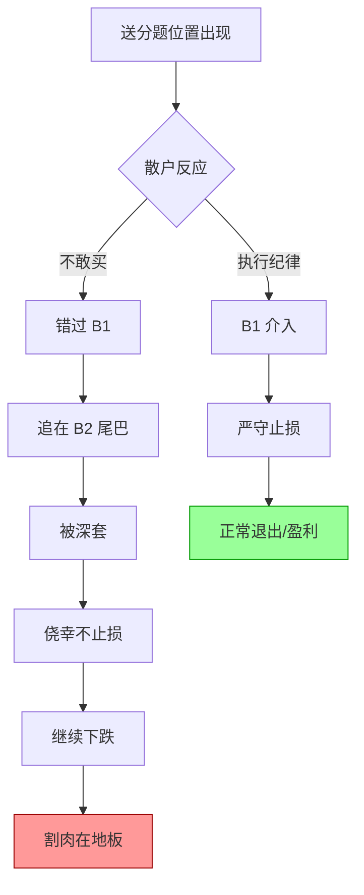

# 490别把送分题做成送命题

> [!abstract]+ 一句话定义
> **490 别把送分题做成送命题**是 Z 哥代号 490 直播的核心心法——市场已经给出确定性极高的安全位置(送分题),但散户因贪婪/恐惧反向操作,把唾手可得的盈利做成了灾难性亏损(送命题)。

## "490"代号溯源

- "490"是 Z 哥某次直播代号(500 - 10 缺位的口播暗号)
- 该期直播专门讲解散户最常见的反人性失误
- 后被 Z 家军总结为风险控制铁律

## 核心命题

> [!important]+ 送分题的特征
> **送分题 = 极高胜率 + 极低风险位置**
> - [[B1建仓波]] 满足 [[两个30%原则]] 的标准买点
> - [[超级B1]] 缩量回调 + 放量破位 + 缩量企稳
> - [[黄金坑三大分类]] 中的小坑/大坑
> - 七连阴/八连阴后的极端超跌
> - [[白线黄线系统]] 黄线企稳
>
> **送命题的特征**
> - 在送分题位置不敢买,等涨起来再追
> - 追在尾盘冲高,次日开盘被埋
> - 套牢后不止损,等"反弹再卖"
> - 反弹时舍不得卖,等"回本再走"
> - 继续下跌后割肉在地板
> - **把 5% 的小亏,搞成 30% 的灾难**

## 反人性失误三连杀

## Z 哥的反思框架

### 为什么散户做反?

| 阶段 | 散户心理 | 应对心法 |
|------|----------|----------|
| **送分题出现** | "再等等,确认下" | [[四不原则]] 之"不慌" |
| **送分题错过** | "可惜了,一定要追回来" | [[四不原则]] 之"不追" |
| **追高被套** | "应该会反弹的" | [[嘀嘀战法]] 严守止损 |
| **小亏不止** | "等回本就走" | [[七层应对]] 之"盈转亏必走" |
| **大亏后割** | "再也不炒股了" | [[防守哲学]] 重建认知 |

## 实战法则

### 三看三不看

| 要看 | 不看 |
|------|------|
| 看位置(B1/B2/B3) | 不看消息面 |
| 看量价(倍量/缩量) | 不看 K 线"形态" |
| 看纪律(止损/止盈) | 不看持仓成本 |

### 送分题清单

> [!success]+ 送分题(可以做的题)
> - [[B1建仓波]] + 满足 [[两个30%原则]]
> - [[超级B1]] 三阶段完整出现
> - [[黄金坑三大分类]] 小坑回填
> - [[B2突破]] 五大铁律 + 三大暴力图形
> - [[暴力K]] 配合关键位置
> - [[砖形图]] 绿砖转红砖

### 送命题清单

> [!danger]+ 送命题(碰都别碰的题)
> - 主升浪末期的尾盘冲高
> - [[十张死亡K线图]] 中的任意一种
> - [[S1信号]] 出现后的"侥幸不走"
> - 追龙头股龙头板的尾巴
> - "传闻"、"内幕"驱动的炒作
> - 已经横盘 30+ 天的"突破"

## 历史案例(代表性教训)

> [!warning]+ Z 哥常说的散户三大悲剧
> 1. **2015 股灾**:6 月顶部多少散户在融资融券广告里加杠杆 → 半年腰斩
> 2. **2018 长熊**:抄底再抄底,从 3500 抄到 2440 → 三个月归零
> 3. **2024 救市**:9 月 24 日满仓追涨 → 国庆后大规模套牢

## 关联连接

- [[防守哲学]] — 心法的根基
- [[四不原则]] — 不追/不动/不慌/不乱摸
- [[七层应对]] — 套牢后的逃生路径
- [[B1建仓波]] — 最常见的送分题
- [[嘀嘀战法]] — 严守止损的执行工具
- [[空仓策略]] — 不会做时直接休息
- [[盈亏比与胜率]] — 概率思维基础
- [[逃顶艺术]] — 顶部送命题识别
- [[十张死亡K线图]] — 死亡形态清单
- [[周期与人性]] — 反人性失误根源
- [[交易心理]] — 心理修行
