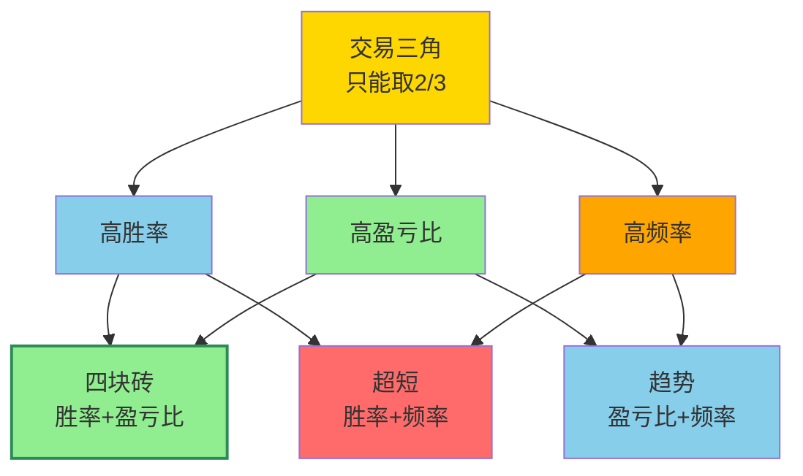

## 定义

> [!abstract] 一句话定义
> 不可能三角是 Z 哥概率论:交易中**不可能同时满足 高胜率 + 高盈亏比 + 高频率**,只能取其中两个。**什么都想要的人最后什么都得不到**。

## 关键信息
- 四块砖取的是高盈亏比
- 超短取的是高频率
- 不可能三角的囚徒：什么都想要的结果是什么都得不到

## 三角取舍

> [!warning] 选定即放弃
> 选了四块砖就要接受频率低,选了超短就要接受赔率小。**三选二是铁律,不是建议**。

## 关联连接
- [[盈亏比与胜率]] — 不可能三角的具体体现
- [[四块砖交易体系]] — 取舍后的选择
