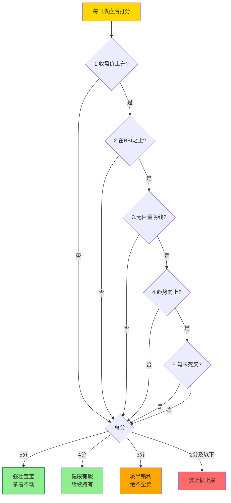

## 定义

> [!abstract] 一句话定义
> 少妇战法 1.3 是少妇战法 1.0 的"补丁包"——专治**主升浪中卖飞**。核心产出物是**每日持股检查手册** + **五分制评分系统**:收盘后给持仓打分,**4-5 分死拿 / 3 分减半锁利 / ≤2 分离场**。**只看收盘价抬升 + 不破 BBI = 神**。

## 卖飞的四种心理病灶

1. **利润回撤恐惧症**：赚了20%连2%回撤都受不了，盘中盯着分时图恐慌
2. **日内波动惊吓症**：冲高回落时产生"要崩盘"的幻觉，在最低点交筹码
3. **仓位强迫症**：手里只剩少量仓位觉得"无所谓了"，草率清仓后主升浪启动
4. **完美主义洁癖**：因高开买入成本不完美，后续随意卖出

## 每日持股检查手册（六条铁律）

### 第一条：无视盘中冲高回落（特别是冲刺阶段）
- 主升浪中主力不想让太多人上车，手段是**盘中大幅拉高后快速下杀洗盘**
- 连续缩量小阴线是"空中加油"，不是见顶信号
- **所有冲高回落都是主力在演戏**，哪怕是真的顶也只有一个，不可能每次都碰到

### 第二条：验证尾盘的"黄金修复力"
- 当天下杀不要紧，关键看怎么收场
- 盘中杀到-8%尾盘收回-2% → 强壮，主力在低位接回筹码
- 次日企稳（十字星）或反包一半 → 继续拿
- 次日继续大幅下杀不回头 → 该止损止损

### 第三条：严禁在"无厘头急杀"中交出筹码
- 没有利空、不在高位连板见顶、突然1-5分钟砸跌停 → **不要在急杀中卖出**
- 换手率正常（如昨天13%今天8%），主力出不去货，就是吓你
- 心态："有本事你打穿我的止损线，没打穿我就拿着"

### 第四条：大盘下杀时的"相对强度论"
- 大盘不行时个股还能逆势往上走 → 主力原本想做多，后来被动跟随下跌
- **比大盘强的票，至少多看一天**
- 大盘微跌它跌停的"垃圾"除外

### 第五条：缩量小阴线，默认"再等一天"
- 涨了40%后歇口气跌1.5%缩量阴线 → 合理的"礼貌性回调"
- 不破BBI线 + 缩量阴线 → 接着持有

### 第六条：不要主观臆断，不破BBI线就是神
- 收起预测能力，**只要股价还在BBI线之上就拿着**
- 完美形态的票不要因为"觉得害怕"去卖

## 终极奥义：只看收盘价抬升

在主升浪和趋势形成后，把K线形态、成交量、MACD指标统统忘掉，回归第一性原理：

- **唯一指标：今天的收盘价 > 昨天的收盘价**
- 哪怕是一根"假阴真阳"线（高开低走绿色K线），只要收盘价高于昨天，主力就在做多
- **只要收盘价在提高，就死死拿住**，甚至不用看盘中波动，收盘看一眼即可

这就是**"空位三分"**的核心：像库里有了空位三分一样，姿势不完美没关系，只要球能进（价格在涨）就出手。

## 五分制持仓评分系统

每天收盘后给持仓打分（满分5分）：

| 评分项 | 判定标准 |
|--------|---------|
| 1. 收盘价是否上升 | 今天收盘价 > 昨天收盘价 → 1分 |
| 2. 有没有跌破BBI线 | 股价在BBI之上 → 1分 |
| 3. 有没有巨量阴线 | 缩量调整或阳量 → 1分；巨量阴线 → 0分 |
| 4. 趋势是否向上 | N型结构，低点抬高、高点突破 → 1分 |
| 5. "勾"是否死叉 | 金叉或张口向上 → 1分；死叉向下 → 0分 |

**评分执行手册**：
- **5分**：强壮的宝宝，拿着不动
- **4分**：健康但有瑕疵，继续持有
- **3分**：及格线，可以减半仓锁利润但**绝对不能全卖**（防止踏空）
- **2分及以下**：该止损止损，该离场离场

## 五分制评分决策流程

> [!tip] 终极口诀
> **只要收盘价在提高,就死死拿住** —— 把 K 线、量、MACD 全忘掉,回归第一性原理。

## 金叉死叉的真相

传统MACD/KDJ金叉买死叉卖是Windows 95时代产物，在A股已被主力玩坏：
- 金叉往往是诱多，死叉往往是诱空
- 看"勾"是否死叉的意义不是让你死叉卖，而是预判**明天早盘会有散户恐慌抛压**，提前做好心理准备应对洗盘

## 关联连接

- [[少妇战法]] — 少妇战法1.3是在1.0六步SOP基础上的持股心法补丁
- [[五分制持仓评分系统]] — 每日持股检查的核心打分工具
- [[交易心理]] — 卖飞的四心理病灶与克服方法
- [[去弱留强]] — 五分制评分后的去弱留强执行
- [[防守哲学]] — 不预测只应对的防守思维
