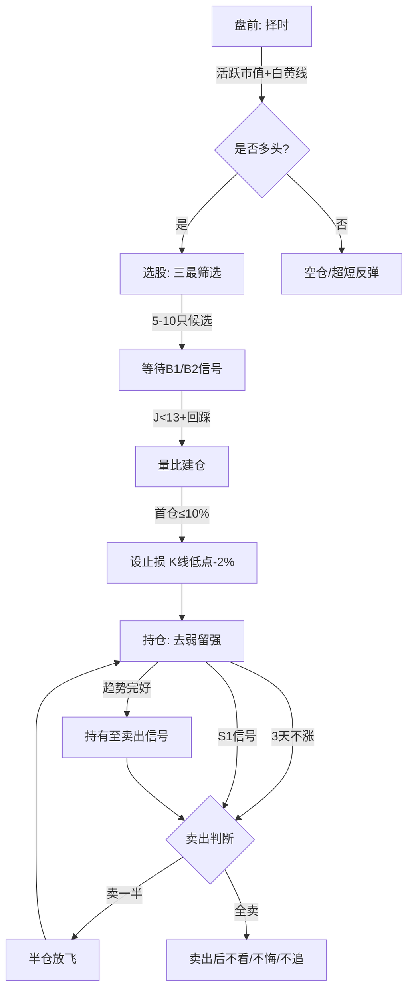

## 研究问题
从开盘到收盘，一个短线交易者（持仓周期1-5天）应该如何按照Zettaranc交易体系完成一次完整的交易闭环？

## 核心结论

> [!abstract] 五句话概括
> 1. **择时→选股→等信号→买入→持仓→卖出**，六步闭环，步步有标准
> 2. 择时永远大于选股，先看大盘再决定开仓与否
> 3. 只做上涨趋势的N型结构，横盘和下跌趋势绝不参与
> 4. 盈亏比优先于胜率，止损控损2-3%，B1/B2捕空间20%+
> 5. 盘中绝大多数时间是垃圾时间，真正的窗口只在开盘30分钟和关键信号出现时

## 交易流程图

## 详细论证

### 一、盘前准备：判断今日能否开仓

**第一步：看大盘环境（择时）**
- 打开**[[活跃市值]]**指标，判断当前处于多头区间、空头区间还是震荡区间
- 查看大盘**[[白线黄线系统]]**：
  - 白线在黄线上方 → 多头趋势，可以积极操作
  - 白线在黄线下方 → 空头趋势，空仓或只做超短反弹
  - 白黄纠缠 → 震荡市，降低仓位、提高选股标准

> [!warning] 开仓纪律
> 只有多头区间或震荡偏多才考虑开仓。空头区间**严格执行空仓纪律**。

**第二步：确定今日主线**
- 参考**[[顺周期轮动]]**规律，判断当前市场处于哪个轮动阶段
- 查看前日涨停板块和资金流向，确定**[[绝对主线]]**
- 只做主线和主题投资，杂毛不碰

### 二、选股：建立候选池（只选最美）

**第三步：三最筛选**
- **只选最美**：用审视艺术品的眼光挑剔图形，筛选出N型上涨结构完美、筹码锁定良好的标的
- 排除所有以下形态：
  - 长期下跌趋势中的横盘（大爷图陷阱）
  - 跳空建仓形态
  - 高位放量上影线
  - 建仓波位置过高（底部已涨75%+）

> [!tip] 候选池规模
> 5-10只即可，宁缺毋滥。

### 三、盘中等待：信号不出现绝不开枪

**第四步：等B1或B2信号**
- **B1建仓波信号**：KDJ的J值 < 13，股价回踩关键支撑位
  - 日线B1适合主题票（一波流）
  - 周线B1更适合主线票（中长线）
  - 用**[[两个30%原则]]**筛选真假B1：涨幅30%左右、累计换手率不超过30%
- **B2突破信号**：B1后的放量突破确认阳线
- **B3买点**：B2后的中继确认，确定性最高但盈亏比最低

> [!danger] 等待纪律
> - 开盘前30分钟是资金博弈最激烈的时段，**观察但不急于操作**
> - 没有B1/B2信号**绝不开仓**
> - 一周**最多两枪**，不要频繁交易

### 四、买入：精细化建仓

**第五步：确认买入时机**
- B1出现后，第二天开盘使用**[[量比战法]]**精细化建仓
- 量比异常放大（资金确认流入）时跟进
- 建仓分批次，首次试仓不超过总资金的10%

**买入即设止损**：
- 止损价 = 买入K线最低价向下1%-3%
- 或前N型结构低点
- 核心：单笔亏损控制在3%以内

### 五、持仓：去弱留强+半仓放飞

**第六步：持仓管理**
- **3天内必须恢复上涨**：低位不涨必有妖，最多再看1-2天
- **[[去弱留强]]**：同时持有多个仓位时，只留最强的，弱的果断止损
- **[[半仓放飞策略]]**：遇到S1信号或不确定图形时，卖一半锁定利润，剩下的一半用白线当牵牛绳

> [!quote] 心态管理
> - 股票不是爱情，不涨就换
> - 好股票不套人，套人的不是好股票
> - 跌了心态不崩（已设止损），涨了不踏空（还有半仓）

### 六、卖出：果断止盈止损

**卖出触发条件（优先级从高到低）**：
1. **跌穿止损**：直接全卖，别犹豫，这是生命线
2. **[[S1信号]]**：高位放量阶段性顶部预警，卖一半或全卖
3. **[[DSZ战法]]**三铁律：
   - 绿砖出现且跌破白线 → 卖
   - 连续两根绿砖 → 卖
   - 放量滞涨 → 卖
4. **连续两日收盘跌破BBI线**（少妇战法离场信号）
5. **[[四块砖交易体系]]**反转信号：红砖/绿砖判断变盘点

> [!danger] 卖出铁律
> - 卖出后**不看、不悔、不追**
> - 止盈卖出后即使继续涨也不后悔（只赚认知范围内的钱）
> - 止损卖出后即使立刻反弹也不追（说明认知外）

### 七、收盘复盘：记录与迭代

**每日复盘清单**：
- [ ] 今日开仓是否符合择时条件？
- [ ] 选股是否遵循三最原则？
- [ ] B1/B2信号是否标准？
- [ ] 止损是否及时执行？
- [ ] 半仓放飞是否操作正确？
- [ ] 是否有手痒开仓、情绪交易？

## 八、市场环境应对

### 震荡市（白黄纠缠）
- **仓位**：降至 3-5 成，提高选股标准
- **策略**：只做最确定的 B1 信号，放弃 B2 追涨
- **节奏**：涨不动就卖，不恋战，快进快出
- **心态**：震荡市赚小钱就是赢，不要幻想单笔暴富

### 牛市（白线大幅高于黄线）
- **仓位**：可提至 7-8 成，底仓+动态仓并行
- **策略**：用 [[少妇战法]] 六步 SOP，重点做主线票
- **节奏**：牛市持股不动是常态，频繁换手反而错过主升浪
- **陷阱**：牛市末期要警惕情绪狂热时的派发信号（[[主力出货五种经典方式]]）

### 熊市（白线在黄线下方）
- **仓位**：0-2 成，极轻仓位练手
- **策略**：空仓为主，偶尔做超跌反弹（要求图形极度完美）
- **纪律**：熊市亏损主要来自不甘心空仓

## 九、资金体适配

| 资金量 | 仓位建议 | 战法选择 | 注意要点 |
|-------|---------|---------|---------|
| 10万以下 | 全仓单票 | 少妇战法、量比战法 | 灵活性是优势，进出自由 |
| 10-50万 | 2-3票分散 | B1建仓+半仓放飞 | 控制单票风险，分散但不杂 |
| 50-100万 | 3-5票 | 开超市模式，去弱留强 | 流动性开始受限，注意冲击成本 |
| 100万以上 | 底仓+动态仓 | 参考长线操作手册 | 建议逐步向长线策略过渡 |

> [!warning] 资金体转换
> 资金量增长后，短线策略的灵活性会下降。100万以上应开始学习并逐步过渡到长线策略。

## 十、典型陷阱识别

### 假B1（诱多陷阱）
- 特征：J值确实 < 13，但缩量严重、无主力建仓迹象
- 识别：用 [[两个30%原则]] 校验——涨幅不在30%左右或换手超30%的，大概率是假B1
- 应对：B1出现后用 [[量比战法]] 确认资金意图，量比 < 10 的当天不抱期望

### 假突破（B2失败）
- 特征：放量突破但次日立即回吐，形成"金叉空"结构
- 识别：突破后缩量滞涨，量价背离
- 应对：止损设在B2阳线中值，跌破即走

### 大爷图陷阱（长期下跌趋势中的横盘）
- 特征：长期下跌后出现横盘，看似"见底"
- 识别：高点在降低、低点也在降低，横盘只是下跌中继
- 应对：永远只做上涨趋势的N型结构，横盘和下跌趋势绝不参与

### 诱多/诱空信号
- **金叉空**：金叉次日马上死叉，诱多陷阱
- **死叉多**：死叉次日反包向上，诱空陷阱
- 来源：[[白线黄线系统]] 4.7.2 升级版重新定义金叉/死叉为诱导信号

## 关联连接
- [[少妇战法]] — 短线交易的六步SOP核心框架
- [[B1建仓波]] — 核心买入信号
- [[DSZ战法]] — 卖出三铁律
- [[交易心理]] — 克服手痒和恐慌
- [[不可能三角]] — 高胜率、高盈亏比、高频率不可兼得，短线优先盈亏比
- [[N型结构]] — 所有走势的底层判断依据
- [[盈亏比与胜率]] — 短线优先盈亏比的数学基础
