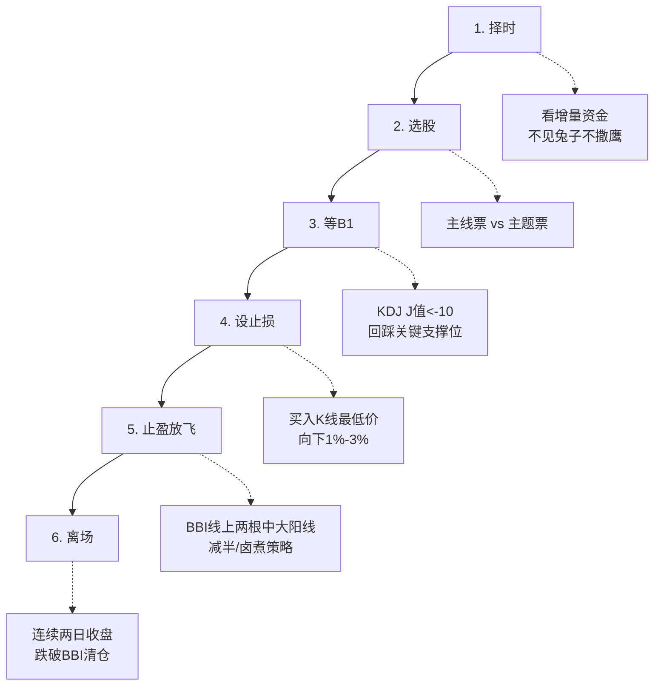

## 定义

> [!abstract] 一句话定义
> 少妇战法是Z哥开发的一套系统性交易策略，核心是"极度风险厌恶、落袋为安、顺势而为"。通过六步标准动作（SOP）实现"永不套牢"的目标，适合资金量100万以下的中小投资者。

## 关键信息
- **六步通关秘籍**：
  1. **择时**：看增量资金，不见兔子不撒鹰
  2. **选股**：主线票（中长线配置）vs 主题票（短线博弈）
  3. **等B1**：KDJ的J值大幅负值（-10以下），回踩关键支撑位
  4. **设止损**：买入K线最低价向下1%-3%，只输一根K线
  5. **止盈放飞**：BBI线上两根中大阳线减半（卤煮策略）
  6. **离场**：连续两日收盘跌破BBI线清仓
> [!danger] 三大铁律
> - 不要频繁交易（一周最多两枪）
> - 只做主线和主题投资
> - Z哥走了就不看了
- **底层逻辑**：顺大势逆小势，买在缩量抛压枯竭点，止损空间小（2-3%），向上空间大（20%+），盈亏比10:1
- **大爷图陷阱**：长期下跌趋势中的横盘震荡是下跌中继，不是底部

## 知识冲突

> [!caution] 冲突点：B1信号J值阈值的语境差异
> - **空谷幽兰（202601）**：少妇战法第三步"等B1"要求J值大幅负值（-10以下），回踩关键支撑位
> - **精水流深（202603）**：通用B1标准仅为J值 < 13，-10、-14都算有效B1
> - **差异原因**：少妇战法面向100万以下中小投资者，极度风险厌恶，因此对B1筛选更严格；精水流深是通用体系输出，标准更宽松以覆盖更多场景
> - **采用方案**：执行少妇战法六步SOP时，以-10以下为B1筛选标准；通用场景或资金量较大时，可采用 <13 的标准。两种标准不矛盾，是同一概念在不同风险偏好下的应用

## 六步SOP流程图

## 关联连接
- [[B1建仓波]] — 少妇战法的核心进场信号
- [[知行趋势线]] — 少妇战法的BBI线升级
- [[超级B1]] — 少妇战法的高级形态
- [[交易心理]] — 克服贪婪恐惧，做到知行合一
- [[不可能三角]] — 高胜率、高盈亏比、高频率不可兼得
- [[防守哲学]] — 穿越牛熊的核心是防守
