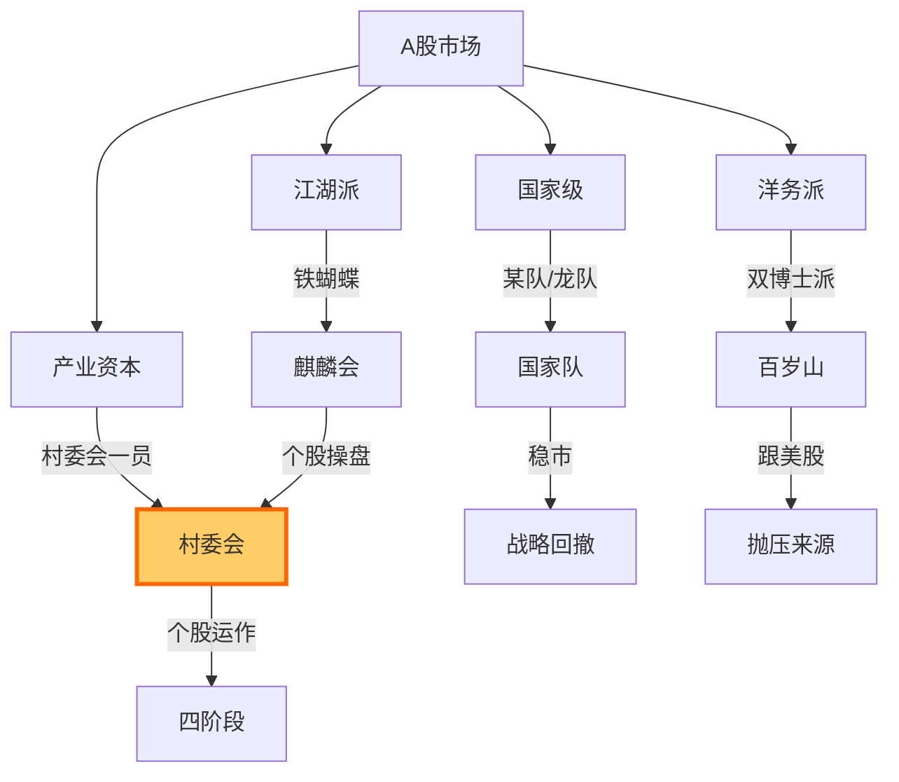

# 村委会

> [!abstract]+ 一句话定义
> **村委会**是 Z 哥黑话中对**单只股票中长期主力资金**的拟人化称呼,意指"管理这片庄稼地的村干部"——决定庄稼怎么种、什么时候收割。

## 黑话起源

- "庄家"是传统说法,带有贬义和神秘感
- Z 哥用"村委会"取代,意在去神秘化:**主力不是神,只是管这片地的村干部**
- 通常是 [[麒麟会]] 一类的江湖派资金,或者公募/私募/产业资本

## 村委会运作四阶段

| 阶段 | 别名 | 散户视角 | 操作建议 |
|------|------|----------|----------|
| **吸筹期** | "插秧" | 横盘磨人,看不懂 | [[B1建仓波]] 介入 |
| **拉升期** | "施肥" | 涨了不敢追 | 跟随趋势 |
| **派发期** | "灌水" | 看似还在涨 | [[七层应对]] 启动 |
| **回落期** | "收割" | 跌不动了想抄 | [[四不原则]] 不抄底 |

## 村委会 vs 散户的对话结构

> [!quote]+ Z 哥的村委会对话
> "村委会跟散户的对话不在 K 线上,在筹码上。
> 散户问 K 线:'怎么涨这么快?'
> 村委会答筹码:'因为你的筹码我已经拿够了。'
> 散户问 K 线:'怎么又跌了?'
> 村委会答筹码:'因为我已经派给下一波接盘的人了。'"

## 村委会的"作业本"

每个村委会都有自己的"作业本"——通过 K 线/量价/筹码留下痕迹:

### 吸筹期的作业本

- [[白线黄线系统]] 黄线下方的横盘平台
- [[砖形图]] 持续绿砖伴随地量
- [[关键K]] 在底部反复出现倍量长阳但快速回落

### 拉升期的作业本

- 突破前期高点的 [[暴力K]]
- 连续多日的 [[砖形图]] 红砖
- [[B2突破]] 五大铁律的完整呈现

### 派发期的作业本

- 高位放量但价格滞涨
- [[S1信号]] 出现
- [[逃顶艺术]] 五种 S1~S5 形态

### 回落期的作业本

- 跌破 [[白线黄线系统]] 黄线
- [[十张死亡K线图]] 中任意形态
- 量价齐缩,无人接盘

## 与其他资金画像的关系

## 散户应对原则

> [!important]+ 跟村委会做朋友,不要做对手
> 1. **不质疑村委会**:村委会主动操盘的票,不要轻易摸顶抄底
> 2. **看清村委会意图**:吸筹期跟,派发期逃,回落期空仓
> 3. **村委会换班要警觉**:不同村委会接力,注意操盘风格变化
> 4. **跟村委会一起睡觉**:中长期持有时,听村委会的节奏

## 关联连接

- [[麒麟会]] — 典型的村委会代表
- [[国家队]] — 国家级村委会
- [[百岁山]] — 与村委会对手盘的洋务派
- [[五类资金画像]] — 资金分类体系
- [[筹码战争]] — 村委会运作的本质
- [[筹码三段论]] — 顶底筹码峰转移
- [[战略回撤]] — 村委会的洗盘动作
- [[B1建仓波]] — 跟村委会一起吸筹
- [[七层应对]] — 村委会派发后的逃生
- [[四不原则]] — 不与村委会作对
