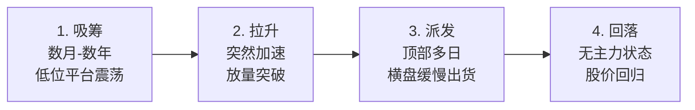

## 定义

> [!abstract] 一句话身份定义
> 某只长期主力资金的代号,Z 哥语境中的「江湖派铁蝴蝶」 — 一支股票里**有实力、有格局**、不追求短期暴利的长期资金。

## 关键信息

### 类型

资金代号(非具体公司),代表 A 股「江湖派 / 中国国情派」长期主力的典型画像。

### 运作四阶段

1. **吸筹**(数月到数年):缓慢建仓,股价在低位平台震荡 — 即 [[B1建仓波]]
2. **拉升**(突然加速):放量突破,主升浪启动 — 即 [[B2突破]]
3. **派发**(顶部多日):横盘震荡缓慢出货,见 [[主力出货五种经典方式]]
4. **回落**:出货完毕后股价回归无主力状态

### 画像特征

因长期视角、行为最规范,麒麟会在图上画出的是**最完美的 [[B1建仓波]] / [[B2突破]] / [[B3买点]] 形态**。是初学者识别「主力四阶段」的最佳教科书。

### 与 [[百岁山]] 的对立

- **麒麟会** = 江湖派 = 中国国情吃透 = 行为可被 K 线读出
- **百岁山** = 学院派 = 华尔街屁股 = 跟美股映射、反复踏空

二者在 Z 哥体系中构成「中国资金 vs 洋务派资金」的核心对照。

### 应用价值

学习「散户视角切换为机构视角」的最佳样本 — 因麒麟会节奏慢、留痕清晰,跟主力的训练应**从读懂麒麟会的脚印开始**。

## 关联连接

- [[Zettaranc]]
- [[百岁山]]
- [[国家队]]
- [[五类资金画像]]
- [[筹码战争]]
- [[B1建仓波]]
- [[B2突破]]
- [[B3买点]]
- [[主力出货五种经典方式]]
- [[大富翁小菜鸟号]]
