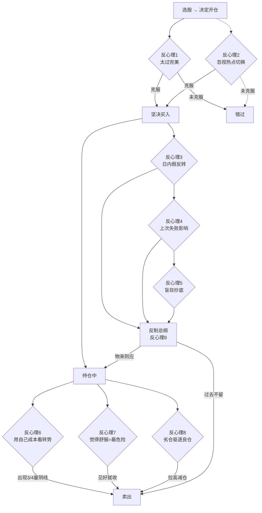

## 研究问题

Z 哥在 2017-12-24 一次性发布的"反心理特征九篇"是 Zettaranc 心法体系的**文字源头**。本 synthesis 回答:

1. **9 篇分别讲什么?**(reflex-level)
2. **9 篇背后的统一算子是什么?**(principle-level)
3. **9 年后(2026 年)这 9 篇如何演化为 Z 哥的现代体系?**(evolution-level)

## 核心结论

> [!abstract] 五句话概括
> 1. 股票交易是**不确定性艺术**,不是确定性科学——这是 9 篇的总纲
> 2. **反心理压力循环**:不确定性 → 恐惧 → 不敢执行 → 没有结果 → 更不确定 → 雪上加霜
> 3. 反制方案:**物来则应,过去不留**(金刚经),买入后看 3/4 量阴线决定持有/卖出
> 4. 9 个反心理特征覆盖**买入前/中/后**全过程,可视为完整的"心理 SOP"
> 5. 9 年后 9 篇的算子(3/4 量阴线 / 8 日成本线 / 砖型图)演化为 [[嘀嘀战法]] / [[白线黄线系统]] / [[砖形图]] 的现代体系

## 全景流程图

## 详细论证

### 一、9 篇内容快速参照

#### 反心理 1: 太过完美而不敢买入
- **表现**:完美突破图形,恨不得马上买,却因为之前同样图形亏损而退缩
- **典型案例**:天业股份(2017-11-04)
- **解决方案**:坚决买入 + 分批控制日均成本 + 第二日 3/4 量阴线即走
- **风险提示**:在上升波段干 10%、震荡波段干 5%、下跌波段干 2-3%

#### 反心理 2: 忽视热点切换的苗头
- **表现**:回调到无穷成本线后大资金进入,但因为消息面乱、之前亏损过、不属于当时热点而忽略
- **典型案例**:中国国航(2017-10-20)、贵州茅台(2016-09-29)
- **解决方案**:第一时间打起精神,只看大资金回流 + 关键位置(无穷成本线)

#### 反心理 3: 日内假反转
- **表现**:大出货后几日内不敢买阳线企稳信号
- **典型案例**:民生银行(2012-12-04)
- **解决方案**:在 8 日 / 60 日成本线企稳处买入,树立盈亏比概念

#### 反心理 4: 上次失败直接影响下次
- **表现**:同一只票连续犯反心理错误,被戏耍后主观放弃
- **解决方案**:用三原则衡量(大局观 + 题材 + 技术图形),与情绪脱钩;节奏 > 个体感受

#### 反心理 5: 看别人抄底成功自己也要试一试
- **表现**:盲目模仿他人的抄底策略
- **典型案例**:东方海洋(2017-11-07)
- **解决方案**:必须有自己验证过的抄底策略,不轻易尝试

#### 反心理 6: 以个人持股成本对待市场的突然转势
- **表现**:用自己的成本预期决定卖点(还没到我期望的利润不卖)
- **典型案例**:保利地产、万科 A
- **解决方案**:站在主力/获利盘角度看,综合获利幅度判断转势

#### 反心理 7: 觉得舒服时风险最大
- **表现**:全盘皆红 → 长上影 → 第二天卖完 → 又拉回去 → 第三天追回 → 又跌回去 → 第四天套牢
- **解决方案**:不得贪胜,见好就收;时刻保持不确定性意识
- **金句**:"千万不要让自己感到舒服,千万不要觉得自己了解市场"

#### 反心理 8: 劣仓驱逐良仓
- **表现**:恐慌时卖出强势浮盈股,留住弱势套牢股
- **核心机制**:个人恐惧 → 主观情绪绑架 → 优先卖客观无问题的强势股
- **解决方案**:
  1. 严格遵守 3/4 量阴线 + 砖型图离场信号
  2. 持有期间出现大幅拉升 → 减仓
  3. 不慌:走坏的拿不动 = 后续最大潜在亏损源

#### 反心理 9(总纲): 反制反心理特征的研究
- **核心论断**:股票交易是**对不确定性的实验**,不是对确定性的研究
- **反心理压力循环**:不确定 → 恐惧 → 不执行 → 没结果 → 更不确定
- **反制公式**:"物来则应,过去不留"(金刚经)
- **执行 SOP**:
  - 买入后看是否 3/4 量阴线 → 出现则次日冲高即走
  - 没出现则继续持有,持续放量则继续观察次日
  - 持有期间加速冲高 → 减仓 / 等次日 3/4 量阴线决定去留

### 二、9 篇背后的两大原始算子

> [!tip] 2017 年的两大算子
> Z 哥所有反心理解决方案都依赖这两个算子:
> 1. **3/4 量阴线**: 买入当日如果出现"成交量 ≥ 前日 3/4 且收阴线",次日必走。这是 Z 哥早期最浓缩的"伪突破识别器"。
> 2. **8 日 / 60 日成本均线**: 大盘龙头股出货或趋势结束的标准是跌破 8 日成本线。21 日均线在两者中间,利润空间不够,优先级最低。

### 三、心法演化:从 2017 到 2026

| 2017 算子 | 2026 演化 | 落地概念 |
|---|---|---|
| 3/4 量阴线 | 前一根 K 线低点滚动止损 | [[嘀嘀战法]] |
| 8 日 / 60 日成本均线 | 白线 = 8 日均线,黄线 = 21 日均线 | [[白线黄线系统]] |
| 砖型图离场 | 红绿砖三铁律 + DSZ 战法 | [[砖形图]] / [[DSZ战法]] / [[四块砖交易体系]] |
| 觉得舒服=风险最大 | 防守哲学第一律 | [[防守哲学]] |
| 物来则应,过去不留 | 不追/不动/不慌/不乱摸 | [[四不原则]] |
| 不确定性艺术论 | A 股博弈本质 | [[A股博弈本质]] / [[盈亏比与胜率]] |
| 在 8 日均线企稳处买 | B1 建仓波 + KDJ J<13 | [[B1建仓波]] |
| 大资金回流 | 异动选股法 | [[异动选股法]] |

### 四、9 篇与"九篇心法"直播的关系

> [!info] 文字版 vs 口语版
> - **本 synthesis(2017 文字版)**: 9 篇文章原文,信息密度高、案例具体、术语早期
> - **[[batch-13-zge-recordings-2026-03]] 中的 26-03-11 直播**: Z 哥 2026 年用 6 万字口语精讲这 9 篇,术语已现代化
> - **跨度对照建议**: 读完文字版后再读口语版,理解 Zettaranc 体系 9 年的演化

## 应用建议

> [!warning] 给读者的三条建议
> 1. **先读 9 才读 1-8**: 第 9 篇是总纲,先建立"不确定性"思维,再看 8 个具体特征
> 2. **每个反心理特征都问自己 3 个问题**:
>    - 这个特征我犯过吗?(自查)
>    - 上次犯的代价是多少?(代价感)
>    - 下次出现时我有什么具体动作?(预案)
> 3. **9 篇 + 现代体系并读**: 单读 9 篇会觉得"算子太原始",必须配合 [[嘀嘀战法]] / [[四不原则]] / [[砖形图]] 等现代版本

## 知识冲突

> [!caution] 9 年的演化中是否有矛盾?
> - **2017 年**: 3/4 量阴线为核心
> - **2026 年**: 砖型图为核心
> - **是否矛盾?**: 不矛盾。3/4 量阴线是单根 K 线判定,砖型图是 4 天循环判定。前者是反应式离场,后者是趋势级离场。两者并存使用。
> - **采用方案**: 短线 1-2 天用 3/4 量阴线;波段 4 天 ~ 1 月用砖型图

## 关联连接
- [[batch-15-gutan-9-essays]] — 本 synthesis 的源摘要
- [[batch-13-zge-recordings-2026-03]] — Z 哥 2026 年精讲版
- [[防守哲学]] — 反心理 7 的现代浓缩
- [[四不原则]] — 反心理 9 的纪律化
- [[交易心理]] — 9 篇的心理学层
- [[嘀嘀战法]] — 3/4 量阴线的现代版
- [[白线黄线系统]] — 8 日 / 60 日均线的演化
- [[砖形图]] — 砖型图算子的现代版
- [[四块砖交易体系]] — 反心理 8 的体系化解决方案
- [[A股博弈本质]] — 反心理 9 的世界观层
- [[盈亏比与胜率]] — 反心理 3 的数学化
- [[B1建仓波]] — "8 日均线企稳"的现代落地
- [[Zettaranc]] — 9 篇的作者
- [[短线交易操作手册]] — 反心理在操作手册中的应用
